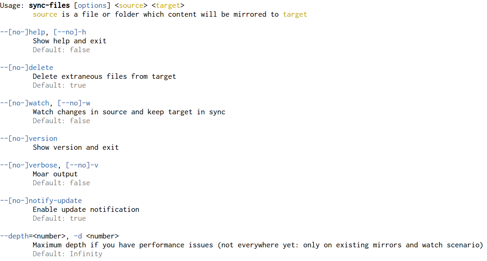
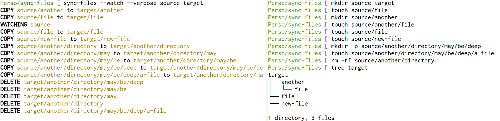

# node-sync-files

Synchronize files or folders locally, with a watch option

## Install

```sh
npm i -g sync-files
```

## Usage



### In your `package.json`

You may have some build script in your package.json involving mirroring folders (let's say, static assets), that's a good use-case for `sync-files`:

```js
// Before
{
  "scripts": {
    "build": "cp -rf src/images dist/",
    "watch": "???"
  }
}

// After
{
  "devDependencies": {
    "sync-files": "^1.0.3"
  },
  "scripts": {
    "build": "sync-files src/images dist/images",
    "watch": "sync-files --watch src/images dist/images"
  }
}
```

## Sample


